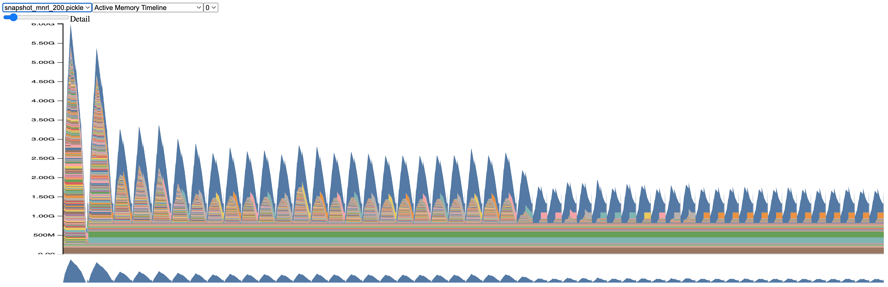
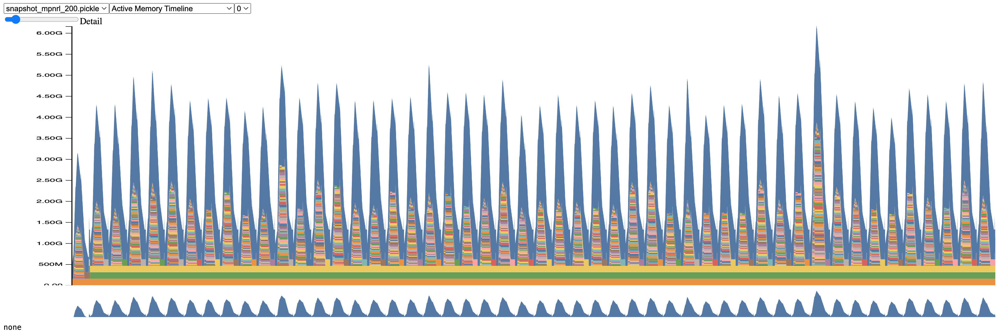
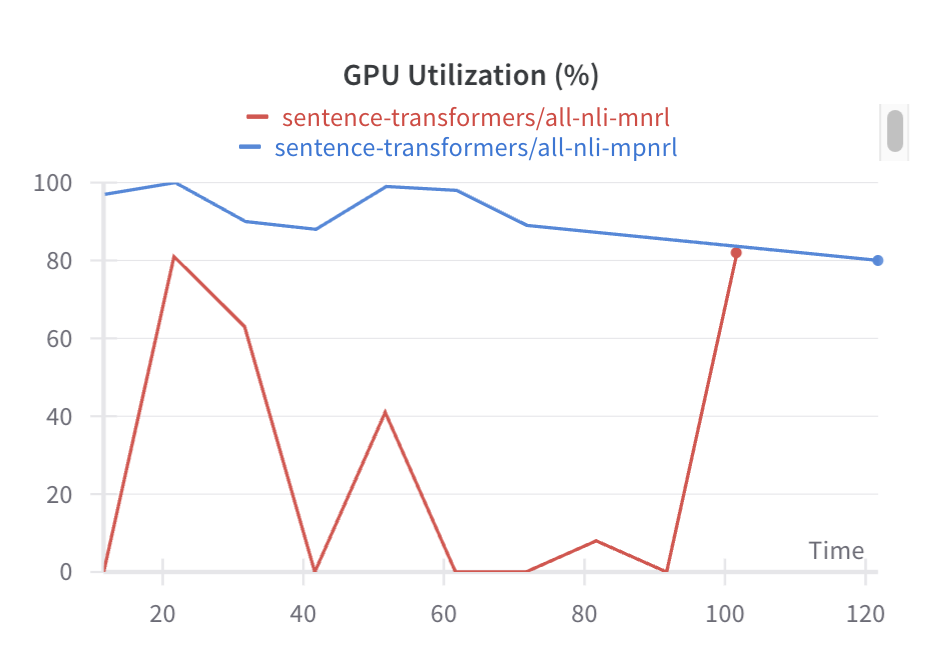

# Multiple Positives and Negatives Ranking Loss

TLDR: on AllNLI, training w/ MPNRL has higher training throughput and better memory
utilization than training w/ MNRL. They're on par in terms of task/statistical
performance, but I'll need to run many more experiments.


## Setup

```
python -m pip install git+https://github.com/kddubey/mpnrl.git
```

To run [`./run.py`](./run.py):

```
python -m pip install "mpnrl[demos] @ git+https://github.com/kddubey/mpnrl.git"
```


NOTE: this isn't meant to be a stable Python package. There are many TODOs.


## Why

No-duplicates sampling hurts training throughput if there's high skewnewss in the number
of duplicated anchors. See the numbers and plots for MNRL + AllNLI in
[`./compare_dataloaders.ipynb`](./compare_dataloaders.ipynb).

Here are CUDA memory snapshots across time for MNRL + AllNLI (first 10k triplets,
inputted batch size of 200):



The drops in memory are caused by drops in the batch size.  There is a long tail of
under-utilization. Peak usage is determined by the first few batches, which is a small
portion of time.

It's simpler to use a loss which seamlessley handles multiple positives. As a result,
training throughput is higher, and GPU utilization (in terms of % memory and % time) is
more stable.

Here are CUDA memory snapshots across time for MPNRL:



Here's a comparison of time-based GPU utilization:



The small experiment in [`./demos/train_allnli.ipynb`](./demos/train_allnli.ipynb)
demonstrates that task/statistical performance is on par with MNRL.

In an experiment on the first 100k triplets in AllNLI and an inputted batch size of 200,
MNRL took ~33 minutes while MPNRL took ~20 minutes. Statistical performance was similar.


## Usage

Make sure to **not** use the no-duplicates sampler for MPNRL.

```python
from sentence_transformers.sampler import BatchSamplers
from sentence_transformers import SentenceTransformerTrainer

import mpnrl

model = ...
train_dataset = ...
# Iterable of these records:
#   {"anchor": ..., "positive": ...}
# Can also have negatives:
#   {"anchor": ..., "positive": ..., "negative": ...}

trainer = SentenceTransformerTrainer(
    model=...,
    train_dataset=...,
    args=SentenceTransformerTrainingArguments(
        ...
        batch_sampler=BatchSamplers.BATCH_SAMPLER,
    ),
    loss=mpnrl.loss.MultiplePositivesNegativesRankingLoss(model),
    data_collator=mpnrl.collator.MPNRLDataCollator(
        train_dataset, tokenize_fn=model.tokenize
    ),
)

trainer.train()
```

There's a small demo in [`./demos/train_allnli.ipynb`](./demos/train_allnli.ipynb).


## TODOs

- [ ] `mpnrl.collator` `TODO`s.
- [ ] `mpnrl.loss` `TODO`s.
- [ ] Measure how long it takes for MNRL vs MPRNL to get to a good model
(pearson/spearman correlation on validation data).
- [ ] Repeat for a few datasets and study how the level of data duplication affects
these outcomes.
